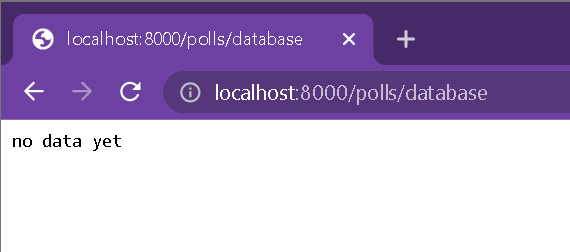
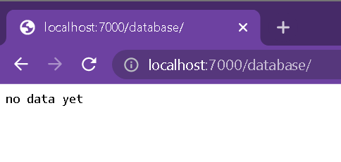
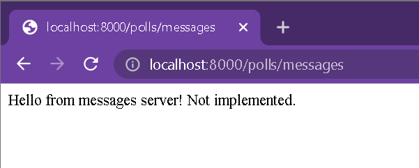
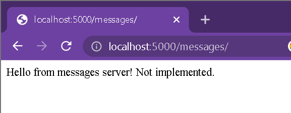
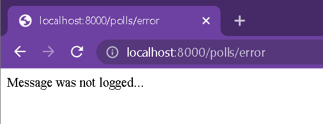
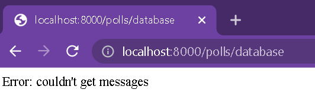
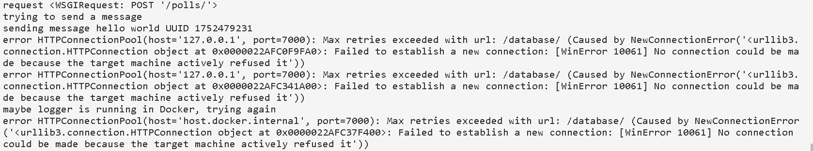

# Lab 1

[Requirements](https://docs.google.com/document/d/1_DCyflPIPCw0-uPTA1xNc3-8m2aUn1mloxOnP1UJ6ho/edit)

## Python tools

Project uses [Django](https://www.djangoproject.com/) web framework and [requests](https://pypi.org/project/requests/) library.

## Code

### Setup Django apps

```bash
python -m django startproject <project>
cd <project>
python manage.py startapp polls # use standard name for now
```

### Hardcoded url's and interacting with application

the `.sh` files intended to run the project, the respective `Dockerfile`s and all functions in the code assume that `facade` runs on `localhost:8000`, `logger` on `localhost:7000`, `messages` on `localhost:5000`

To access the services go to `localhost:<port>/<polls/database/messages>/`, polls/database/messages for `facade`, `logger` and `messages` servers respectively.

For `facade`, in order to record a message go to `localhost:8000/polls/` in order to view the database go to `localhost:8000/polls/database`, there is also a help page on `localhost:8000/polls/help`, to make a request to the `messages` service go to `localhost:8000/polls/messages`

`logger` if accessed from the browser at `localhost:7000/database` also displays all messages. Later we will probably have to recognise that the request is coming from the `facade` and only send data if it is so.

`messages` if accessed from the browser at `localhost:5000/messages` displays a 'Hello...Not implemented' message

### Docker

`Docker` introduces and unpleasant complication: to access one server running in a container from another server, also running in a local container, you need to use `http://host.docker.internal:<port>`. 

Added `localhost`, 	`host.docker.internal` and  `127.0.0.1` to `ALLOWED_HOSTS` in all <facade/logger/messages>/<facade/logger/messages>/settings.py

Also, when making requests from `facade` to `logger` I try reaching both `127.0.0.1` and `host.docker.internal` through try-except.

We can recognize whether our application is running inside a container:
```Docekrfile
ENV RUNNING_IN_DOCKER Yes
```
then do `os.environ.get('RUNNING_IN_DOCKER', False)` - if it exists (or you can check if it is = 'Yes'), we assume we are running in Docker. There is a catch: there is no way to know how the `logger` is running from `facade`. So, for now, I simply try both links

### Logging

right now, in this basic setup, logging is done through simple `print`. 

There is a catch when using Docker: if you are running the server in a Docker container, you need to run the container like this: `docker run ... other parameters... -it <container name>` (notice the `-it`) and the `CMD` command in the Dockerfiles should contain a `-u` flag like this: `CMD ["python", "-u", "manage.py", "runserver", "0.0.0.0:<port>"]`, other wise you won't see all the logs.

Later will probably introduce the `logging` python library

### The code

#### `facade`

##### POST a message

see facade/polls/views.py `get_message` function

```python
def get_message(request):
	...
	# if this is a POST request we need to process the form data
    if request.method == 'POST':
		...
        form = TheForm(request.POST)
        if not form.is_valid():
            return HttpRequest("invalid form")
        msg = form.cleaned_data['msg']
        if log_msg(msg):
            return success
        else:
            return error
    else: # if a GET (or any other method) we'll create a blank form
        form = TheForm()
    
    return render(request, 'form.html', {'form': form})
```

the most important part is `log_msg`. see facade/polls/connection_to_logger.py `log_msg` function

```python
def log_msg(msg):
	UUID = random.randint(0, 2**31)
	...
	url="http://127.0.0.1:7000/database/"
	try:
		# try to send a POST request
	except Exception as e:
		# maybe logger is running in Docker, try again
		url="http://host.docker.internal:7000/database/"
		try:
			# try to make a POST request
		except Exception as e:
			return False
	...
	return True
```

#### view the database

see the facade/polls/views.py `get_messages` function

```python
def get_messages(request):
    if request.method == 'GET':
        return HttpResponse(get_msgs())
    return HttpRequest("Unsupported request method")
```

the core function is function `get_msgs` from facade/polls/connection_to_logger.py

```python
def get_msgs():
	...
	url="http://127.0.0.1:7000/database/"
	try:
		# try to make a GET request
	except Exception as e:
		# maybe logger is running in Docker, try again
		url="http://host.docker.internal:7000/database/"
		try:
			# try to make a GET request
		except Exception as e:
			return "Error: couldn't get messages"
	return str(result)
```

## Results

```bash
bash launch.sh # launches the servers from command line
bash launch-docker.sh # builds and runs servers in docker containers
```

- `logger`

This is how `logger` server looks accessed from the `facade`. As you can see, right now the database is empty



It can also be accessed from its own port like this:



- `messages`

This is how `messages` service can be accessed from the `facade` service



It can also be accessed on its own port:



- sending a message


If message was sent successfully, you see the following:


If it failed, you are transfered to `localhost:8000/polls/error` which displays an error message

let's send a couple more messages and look at the database now. (Each message is displayed in a separate line)


- error logging

let's only launch `facade` service and try to store a message



if we try to access the database:



both times we get something like this logged into the console:




