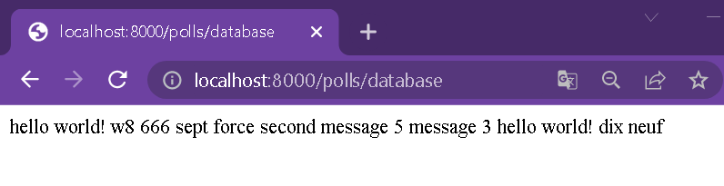
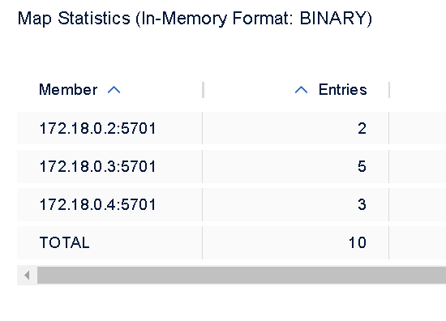
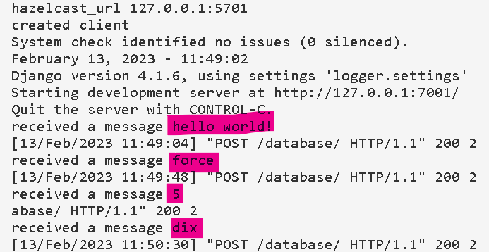
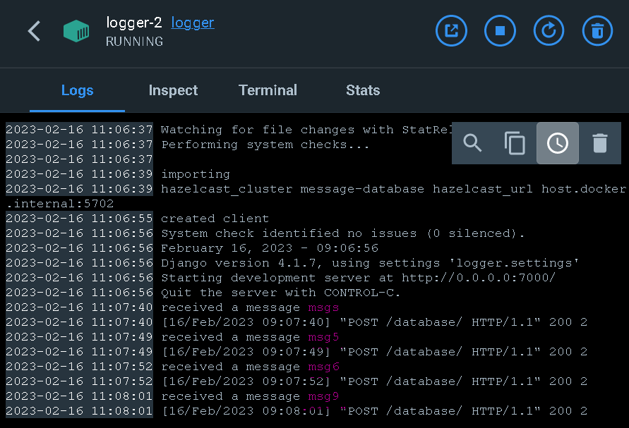
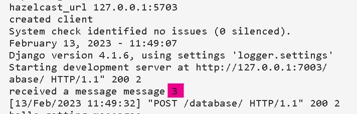

# Lab 3 - Microservices + Hazelcast

[task](https://docs.google.com/document/d/1RWe3xIFfkMUUlI5Ai3ig5xuJvXwZ0JwCU0ZlSZ5mgC8/edit)

## Python tools

Project uses [Django](https://www.djangoproject.com/) web framework and [requests](https://pypi.org/project/requests/) library and [hazelcast](https://hazelcast.com/).

## Usage

see lab1 - micro_basics branch

## Process

### Setup

all necessary commands are in `launch.sh` file. A short version is analyzed in detail below. After launching everything this script waits for `ctrl+c`, then kills all the docker containers and servers. 

```bash
# start facade
cd facade
python manage.py runserver 8000&
```

```bash
# start messages (not necessary)
cd ..
cd messages
python manage.py runserver 5000&
```

```bash
# start logger instances
cd ..
cd logger
INSTANCE=1
export HAZELCAST_URL="127.0.0.1:570"$INSTANCE # should figure out how to specify the url in docker
python manage.py runserver 700$INSTANCE&
docker run \
    --name member-$INSTANCE\
    --network hazelcast-network \
    --rm \
	-d\
    -e HZ_CLUSTERNAME=message-database \
    -p 570$INSTANCE:5701 \
     hazelcast/hazelcast:5.2.1
```

Unfortunately, you can't see the logs in the command line using the approach above. So I provided a convenient alternative: `launch-bash.sh` launches hazelcast instances, `facade` and `messages`, then waits for `ctrl+c` and upon receiving kills the docker containers and stops the severs, and `logger` isntances are launched separately like this `bash launch-logger.sh <instance_number>`.

```
bash launch-base.sh
bash launch-logger.sh 1
bash launch-logger.sh 2
bash launch-logger.sh 3
```

### Docker

In this lab, Docker is used only to work with Hazelcast. Reason - I couldn't create a `hazelcast.HazelcastClient` when `logger` is running in a docker container. Will try to fix in the text lab. 

### Logging

logging is still done through simple `print`.

### Code changes

#### `facade`

`logger` ports are hardcoded (7001, 7002, 7003), we try them in a random order.

```python
# facade/polls/connection_to_logger.py
logger_port_ids=list(range(1,4))
def log_msg(msg):
	# generate uuid
	random.shuffle(logger_port_ids) # try ports in random order
	for i in logger_port_ids:
		port = i+7000
		url = f"http://127.0.0.1:{port}/database/"
		try:
			result = requests.post(url, json={'UUID': UUID,'msg': msg})
			...
			break
		except Exception as e:
			# print error
	return success
```

#### `logger`

When we launched `logger` instances, we set `HAZELCAST_URL` environment variable with url of its correspondent hazelcast instance. Later we use this variable when creating the `hazelcast` client.

```python
# logger/logger/hazelcast_client.py
# imports
hazelcast_url = os.environ.get('HAZELCAST_URL', False)
client = hazelcast.HazelcastClient(cluster_name="message-database", cluster_members=[hazelcast_url])
```

## Results

```bash
bash launch.sh # launches the servers from command line
```

Now the testing:

The 3 launched logger nodes. They are empty right now.

</img>
</img>
</img>

Let's send 10 messages. We expect them to be distributed randomly between the 3 nodes.

Here are those messages as one line of text:



In the management center we can see that different messages are on different nodes.



Here are what logs of the `logger` instances look like (not all messages can be seen on the screenshots, but you can get the general idea of what logs look like):





* you may have noticed, that the distribution between nodes does not match the logs, that is because I used screenshots from 2 different launches of the system (forgot to go to management center and take a new screenshot on the last test).
