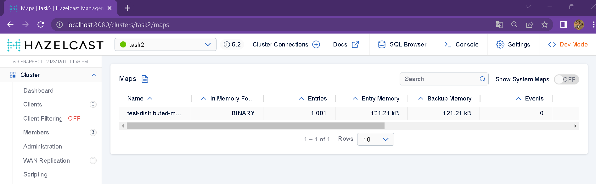

# Hazelcast

## Download and configure Hazelcast

I will use use Docker

## 2 Configure and launch 3 nodes in one cluster

```bash
docker pull hazelcast/hazelcast:5.2.1
docker network create hazelcast-network
for i in 1 2 3 # we will launch 3 nodes
do
docker run \
	--name member-$i\
    -it \
    --network hazelcast-network \
    --rm \
    -e HZ_CLUSTERNAME=task2 \
    -p 570$i:5701 hazelcast/hazelcast:5.2.1
done
```

## 3 Distributed Map

### Create a Distributed Map using API, Write 1000 values into it

see `distributed_map.py`

### See distribution of values between nodes using Management Center

command to run the management-center:
```
docker run --network hazelcast-network -p 8080:8080 hazelcast/management-center:latest-snapshot
```


### Shutdown one\two nodes. Is there data loss?

here are the 1001 entries with keys from 0 to 1000 when all 3 nodes are running



entries are distributed among nodes as follows:


go to Docker and shutdown one of the nodes


how does the map look now?


no entries disappeared, as we can see

also, there is anothe parameter here - "entries and memory". we can see how the number of entries briefly drops after the node is deleted but then all data is restored to the original 1001 entries. it is obvious that the distribution among nodes only refers to **access** to data - each node is responsible for managing only this piece of the data, but in **storage** there are actually multiple **copies** of the data.


let's go and delete another node


no entries disappeared, again, now all entries are on the last remaining running node

something weird happened next, which I can't quite explain:


the number of entries rised to 1500. I have no idea what is going on here...

if we shutdown all 3 nodes, our data is lost and there will be no data present after restart


## 4 Distributed Map with locks

Code is python examples from documentation as well as some adapted code from java examples

* racy example

```python
# racy.py
client = hazelcast.HazelcastClient(cluster_name="task2")
distributed_map = client.get_map("map")
key = "1"
distributed_map.put(key, 0)
for i in range(1000):
	value = distributed_map.get(key).result()
	value += 1
	distributed_map.put(key, value)
print("Finished! Result =", distributed_map.get(key).result())
```

* Pessimistic

```python
# pessimistic.py
client = hazelcast.HazelcastClient(cluster_name="task2")
distributed_map = client.get_map("map")
key = "1"
distributed_map.put(key, 0)
for i in range(1000):
    distributed_map.lock(key)
    try:
        value = distributed_map.get(key).result()
        value += 1
        distributed_map.put(key, value)
    finally:
        distributed_map.unlock(key)
print("Finished! Result =", distributed_map.get(key).result())
```

* Optimistic

```python
# optimistic.py
client = hazelcast.HazelcastClient(cluster_name="task2")
distributed_map = client.get_map("map")
key = "1"
distributed_map.put(key, 0)
for i in range(1000):
    while True:
        oldvalue = distributed_map.get(key).result()
        newvalue = oldvalue+1
        if distributed_map.replace_if_same(key, oldvalue, newvalue):
            break
print("Finished! Result =", distributed_map.get(key).result())
```

There is a file `race_test.py` that combines the above three - starts each example in 3 threads simultaneously.

The result is (each output line corresponds to one thread):


## 5 Bounded queue

I could not complete this task. I found a way to specify a client config like so: `-e "JAVA_OPTS=-Dhazelcast.client.config=/mnt/c/users/diana/documents/onedrive/architecture/hazelcast/config.xml"` when launching the hazelcast nodes and also the task in a docker container. Unfortumately, it has no effect whatsoever on the queue size and my test code keeps inserting way more than 10 elements. 

I tried simulating bounded queue in code buy forbidding element insertion if queue size is == 10 - see `bq_task.py`. Problem - code hangs...
