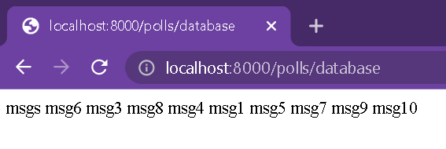
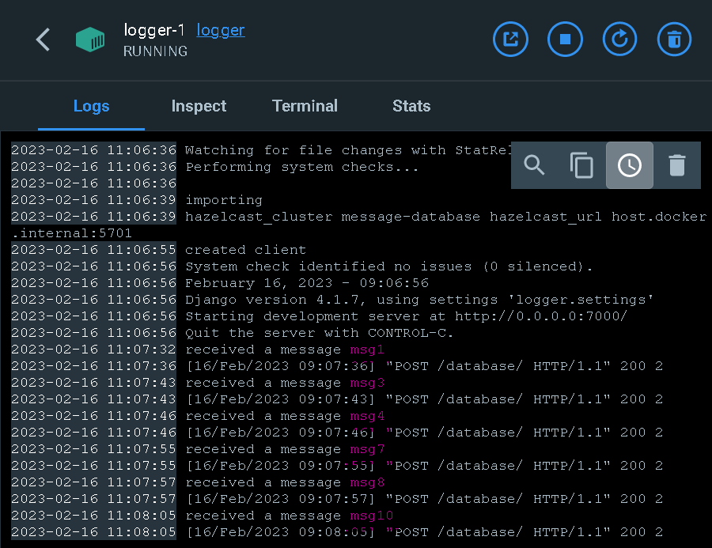

# Lab 4 - Microservices + Message Queue

[task](https://docs.google.com/document/d/1RWe3xIFfkMUUlI5Ai3ig5xuJvXwZ0JwCU0ZlSZ5mgC8/edit)

## Python tools

Project uses [Django](https://www.djangoproject.com/) web framework and [requests](https://pypi.org/project/requests/) library and [hazelcast](https://hazelcast.com/).

## Usage

see lab1 - micro_basics branch

## Process

### Usage

```bash
bash installations.sh # installs dependencies
bash docker-build.sh # builds containers
bash docker-run # runs everything
bash docker-kill.sh # stops everything
```

### Logging

logging is still done through simple `print`.

### Code changes

#### `facade`

`logger` ports are hardcoded (7001, 7002, 7003), we try them in a random order.

```python
# facade/polls/connection_to_logger.py
logger_port_ids=list(range(1,4))
def log_msg(msg):
	# generate uuid
	random.shuffle(logger_port_ids) # try ports in random order
	for i in logger_port_ids:
		port = i+7000
		url = f"http://127.0.0.1:{port}/database/"
		try:
			result = requests.post(url, json={'UUID': UUID,'msg': msg})
			...
			break
		except Exception as e:
			# print error
	return success
```

`messages` ports are hardcoded. we try them in a random order

```python
# facade/polls/connection_to_messages.py
messager_port_ids=list(range(1,3))

def messages_get():
	random.shuffle(messager_port_ids)
	result = ""
	for i in messager_port_ids:
		port = i+5000
		url = f"http://127.0.0.1:{port}/messages/"
		RUNNING_IN_DOCKER = os.environ.get('RUNNING_IN_DOCKER', False)
		if RUNNING_IN_DOCKER:
			url = f"http://host.docker.internal:{port}/messages/"
		print("trying", url)
		try:
			# GET request
			break
		except Exception as e:
			print("error", e)
	return result
```

apart from sending messages to the `logger`, we save them to the queue

```python
# facade/polls/views.py
print("adding message to queue", queue.put(msg)) # line 26
```

### `messages`

There is a queue between `messages` and `facade`. When launching a `messages` instance we also launch a background process that checks the queue periodically and if it is not empty - takes elements from it.

```python
# messages/polls/management/commands/command.py
class Command(DaemonCommand):
	def process(self, *args, **options):
		while True:
			sleep(1)
			if queue.size().result() > 0:
				value = queue.take().result()
				entry = Entry()
				entry.msg = value
				entry.save()
```

```docker
CMD "./run.sh"
# run.sh:
# python manage.py runserver 0.0.0.6000
# python manage.py command # the consumer
```

## Results

Now the testing:

We send 10 messages - msg1-10

Here are those messages as one line of text in the database:



Here are what logs of the `logger` instances look like (not all messages can be seen on the screenshots, but you can get the general idea of what logs look like):




It so happened, the third `logger` instance did not receive any messages, but we can see that it responded to our request for the database.

Let's see what messages the `messages` instances received


We can see the messages stored on `messages` instances on `localhost:8000/polls/messages` (from `facade`, as you remember it runs on port 8000). When we make this request, the page tries to address the `messages` seervices in a random order, so we get different results when refresh teh page


